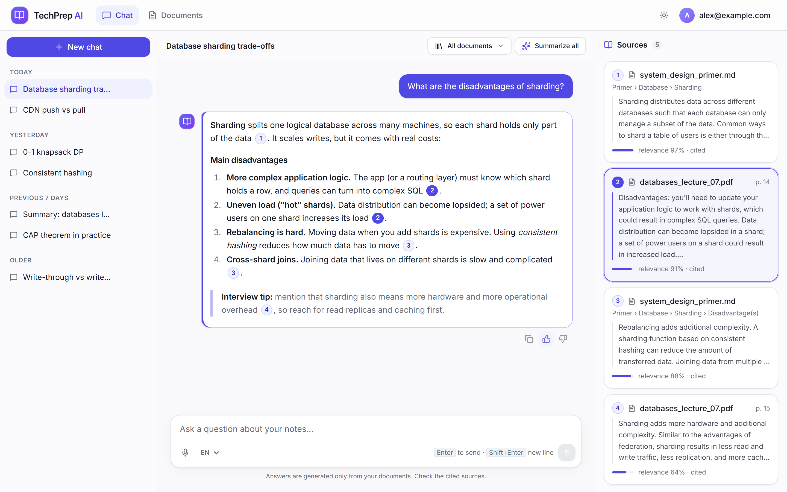
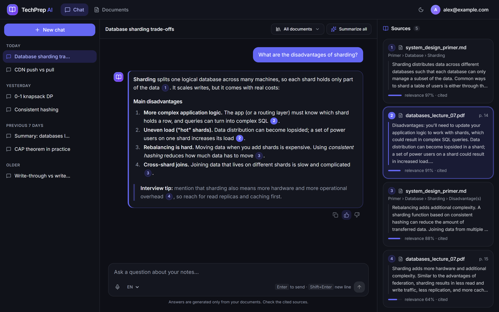
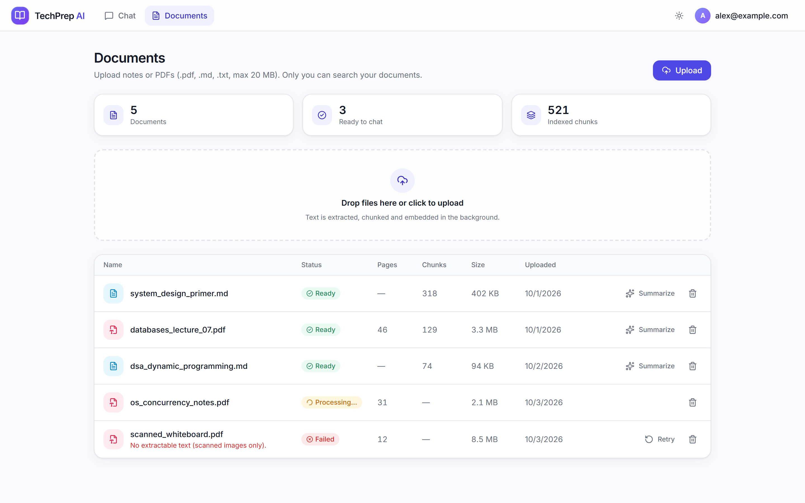
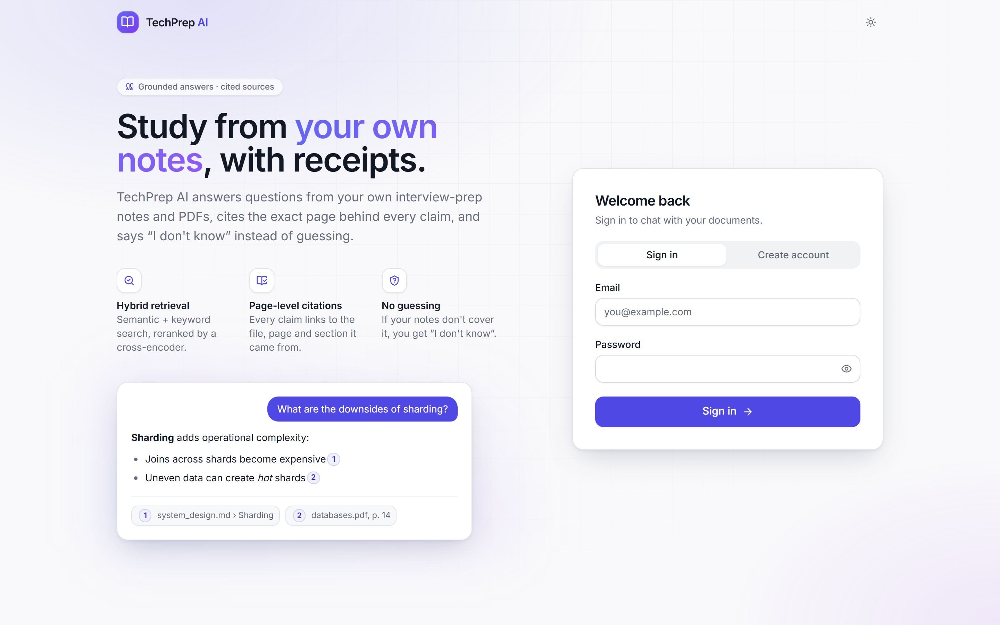
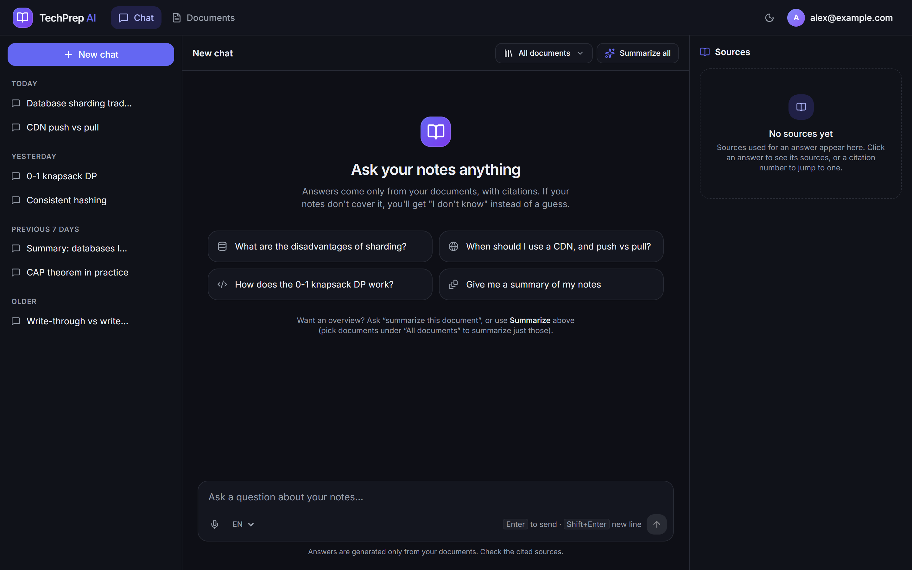
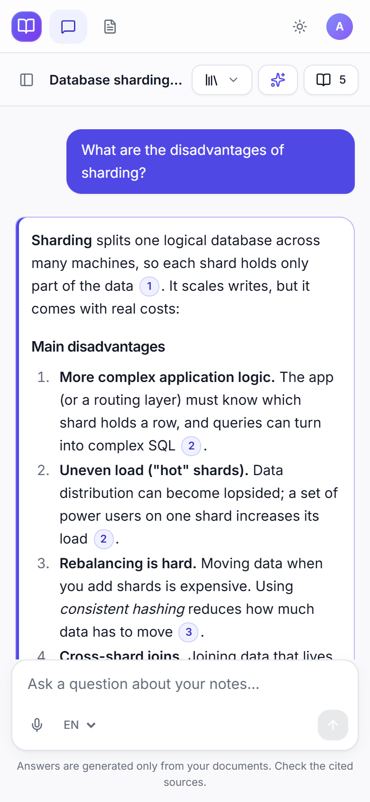
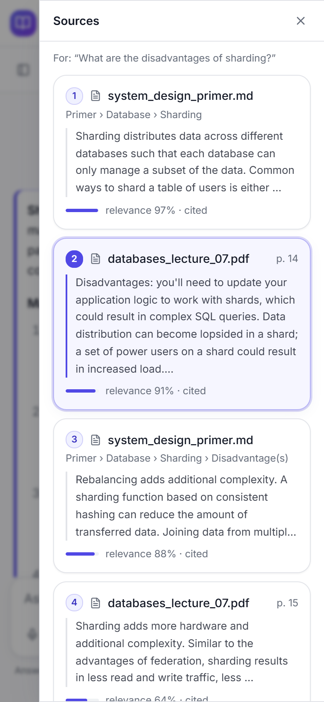
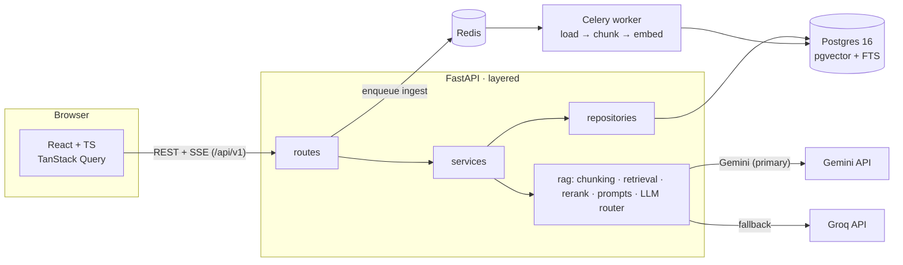
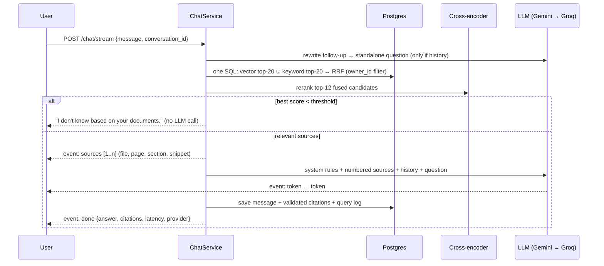
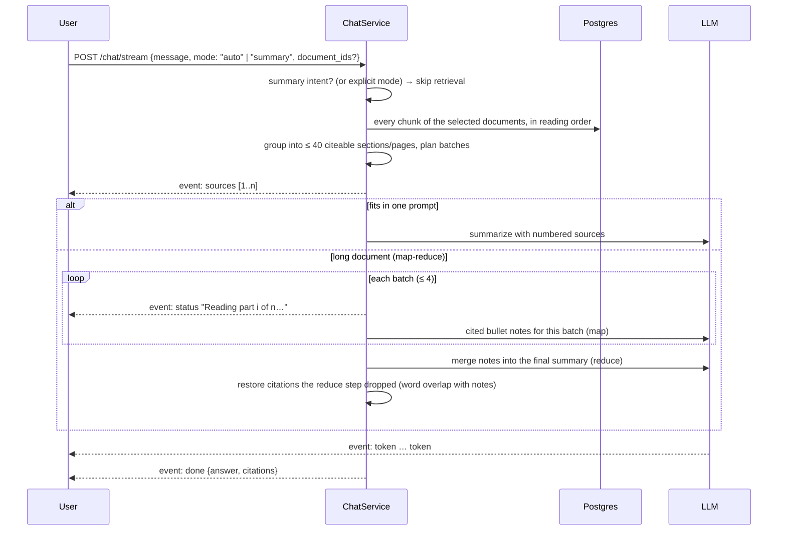

# TechPrep AI

**Chat with your interview-prep notes and PDFs, and get answers with page-level citations.**
If the answer isn't in your documents, it says *"I don't know based on your documents."*
instead of guessing.


Everything is free or open source and sized for an **8 GB laptop**: local embeddings
(bge-small) and reranker (MiniLM) on CPU, Postgres + pgvector instead of a separate vector DB,
and free-tier LLMs (Gemini primary, Groq fallback).



<table>
  <tr>
    <td width="50%"></td>
    <td width="50%"></td>
  </tr>
  <tr>
    <td></td>
    <td></td>
  </tr>
</table>

<p align="center">
  
  &nbsp;
  
</p>

<sub>Screenshots come from the real production build with sample data
(`cd frontend && npm run build && npm run screenshots`, which mocks the API, so no backend or LLM is needed).</sub>

---

## What it does

| | |
|---|---|
| 📄 **Upload** | PDF, Markdown or text (≤ 20 MB). Ingestion runs in the background (Celery worker or in-process), and the UI shows `queued → processing → ready / failed`. |
| 🔎 **Hybrid retrieval** | pgvector semantic search **plus** Postgres full-text keyword search, fused with Reciprocal Rank Fusion, then reranked by a cross-encoder. One SQL query, always filtered by the owner. |
| 📌 **Citations** | Every answer cites numbered sources: `[1]` → `lecture.pdf, p. 14` or `system_design.md › Cache › Write-through`. Citation numbers are validated server-side, and invented ones are never linked. Odd model formats like `【1】` / `【1†L3】` are normalized to `[1]` and shown as clickable chips that highlight the source. |
| 🗂️ **Sources panel** | Every retrieved passage (file, page, section, snippet, relevance, cited or not) is **stored per answer**, so clicking any older answer shows *its* sources. Cited sources come first; low-relevance uncited passages are collapsed under "Other retrieved passages". |
| 📝 **Summaries** | "Give me a summary of the doc", "tl;dr", or the **Summarize** buttons: the whole document (selected ones, or all) is summarized with map-reduce over its sections/pages, with citations to them. Normal retrieval would answer "I don't know" here, because a summary request has no topic words to search for. |
| 🎤 **Voice input** | Mic button next to the text box (browser Web Speech API), English or Hindi, listening indicator, clear message when the browser doesn't support it. |
| 🙅 **"I don't know"** | If nothing relevant is retrieved, the API refuses **without calling the LLM**. The prompt also tells the model to refuse when sources don't cover the question. |
| 💬 **Conversations** | History is persisted; follow-ups ("what about the pull type?") are rewritten into standalone questions before retrieval. Rename and delete chats, copy an answer, stop generating. |
| ⚡ **Streaming** | Server-Sent Events: sources arrive first, then tokens, then validated citations. |
| 🔐 **Multi-user** | JWT auth, `user`/`admin` roles. Users only ever see and search their own documents (enforced in SQL and tested). |
| 📊 **Evaluation** | A 50-question test set with a script that reports Hit@k / MRR, refusal accuracy, LLM-judged correctness and faithfulness, and citation validity, plus ablations. |

## Architecture



**Question → answer:**



**Summary request** ("summarize this document", or a Summarize button):



## Evaluation results

Measured with `python -m eval.run_eval` on the committed sample corpus
(`data/sample`: System Design Primer, cp-algorithms articles, an AI/ML list). Full report:
[`backend/eval/reports/RESULTS.md`](backend/eval/reports/RESULTS.md).

<!-- EVAL_TABLE_START -->
**Retrieval** (42 answerable questions, top-5; "paraphrased" = 17 questions worded without the section's keywords):

| Config | Hit@1 | Hit@5 | MRR@5 | Hit@5 paraphrased | p50 latency |
|---|---|---|---|---|---|
| vector only | 0.91 | 0.95 | 0.93 | 0.88 | 104 ms |
| keyword only (Postgres FTS) | 0.67 | 0.86 | 0.74 | 0.65 | 101 ms |
| hybrid (RRF) | 0.83 | 0.93 | 0.88 | 0.82 | 108 ms |
| **hybrid + rerank** (default) | 0.86 | **1.00** | 0.92 | **1.00** | 2392 ms (CPU) |

**End-to-end answers** (50 questions incl. 8 unanswerable; answer model `gpt-oss-20b`, judge `gpt-oss-120b`):

| Metric | Value |
|---|---|
| Answer correctness (LLM judge; a wrong refusal counts as 0) | **0.94** |
| Faithfulness to retrieved sources (LLM judge) | **0.97** |
| Correct "I don't know" on unanswerable questions | **1.00** (8/8) |
| False refusals on answerable questions | 0.02 (1/42) |
| Answers with ≥1 valid citation / citation validity | 0.90 / 0.98 |
| Latency p50 / p95 (retrieval + generation) | 3.3 s / 4.2 s |

The old version reported faithfulness 0.52 on 5 questions, but its judge only saw the first 500
characters of context, so the two numbers aren't comparable.
<!-- EVAL_TABLE_END -->

How to read it, and its limits, are covered in [docs/INTERVIEW_NOTES.md](docs/INTERVIEW_NOTES.md#evaluation).

## Tech stack (and why)

| Layer | Choice | Why |
|---|---|---|
| API | FastAPI, layered (routes → services → repositories) | Typed request/response models, OpenAPI docs for free; layers keep HTTP, business logic and SQL separately testable. |
| DB | PostgreSQL 16 + **pgvector** (HNSW) + full-text search (GIN) | One database for users, documents, vectors and keywords: transactional deletes, owner filtering in SQL, no extra service to run. |
| ORM / migrations | SQLAlchemy 2.0 + Alembic | Versioned, reviewable schema changes. |
| Auth | JWT access tokens (PyJWT) + Argon2 (pwdlib), roles | Stateless auth that works for SPA and API clients; maintained libraries. |
| Background jobs | Celery + Redis (or in-process "lite" mode) | Slow ingestion never blocks a request; retries for transient failures. |
| Embeddings | `BAAI/bge-small-en-v1.5` via fastembed (ONNX, CPU) | Free, offline, ~130 MB, no rate limits, reproducible eval. |
| Reranker | `ms-marco-MiniLM-L-6-v2` cross-encoder (ONNX, CPU) | Biggest precision gain per MB; toggleable. |
| LLM | Provider-agnostic router: Gemini → Groq (`gpt-oss-20b`), fake for tests | No vendor lock-in, survives rate limits/outages, deterministic tests. |
| Frontend | React 18 + TypeScript + Vite, React Router, TanStack Query | Typed API layer, cached server state, fast dev loop. |
| UI | Tailwind CSS + shadcn/ui-style components (Radix primitives), lucide icons, sonner toasts | One token-based design system (light + dark), accessible dialogs/menus, responsive down to phones. |
| Ops | Docker Compose (lite/full profiles), GitHub Actions, structlog JSON logs, slowapi rate limits, health probes | Same patterns as production services, sized for a laptop. |

## Quick start

### Option A: Docker (recommended)

```bash
cp .env.example .env            # add GEMINI_API_KEY and/or GROQ_API_KEY, set JWT_SECRET
docker compose up --build       # lite: Postgres + API + web (ingestion in-process)
# or the full profile with Redis + Celery worker:
INGESTION_MODE=celery REDIS_URL=redis://redis:6379/0 docker compose --profile full up --build
```

Open http://localhost:8080, create an account and upload notes. API docs: http://localhost:8000/docs.

Load the sample corpus for your account (optional):

```bash
docker compose exec api python -m app.cli seed-sample you@example.com
```

### Option B: Local without Docker (Windows/macOS/Linux)

Requires Python 3.12, [uv](https://docs.astral.sh/uv/) and Node 20. Postgres + pgvector come
from the `pgserver` wheel, so you don't need to install a database.

```bash
git config core.hooksPath .githooks           # enable the "no secrets / personal files" hook
cp .env.example .env                          # add your LLM key(s)

cd backend
uv sync --all-groups
uv run --group localdb python scripts/localdb.py run -- uv run alembic upgrade head
uv run --group localdb python scripts/localdb.py run -- uv run uvicorn app.main:app --port 8000

cd ../frontend
npm ci
npm run dev                                   # http://localhost:5173 (proxies /api to :8000)
```

### Tests, lint, eval

```bash
cd backend && uv run --group localdb pytest   # 94 tests, real Postgres, fake LLM + embeddings
cd backend && uv run ruff check . && uv run ruff format --check .
cd frontend && npm test && npm run lint && npm run typecheck
cd backend && uv run python -m eval.run_eval --retrieval-only     # no LLM calls, ~3 min
cd backend && uv run python -m eval.run_eval                      # + LLM-judged answers
```

## API overview

| Method | Path | |
|---|---|---|
| POST | `/api/v1/auth/register` · `/auth/login` · GET `/auth/me` | JWT auth (OAuth2 password form for login) |
| POST | `/api/v1/documents` | Upload (202, ingested in background) |
| GET / DELETE | `/api/v1/documents[/{id}]` | List / status / delete (chunks cascade) |
| POST | `/api/v1/documents/{id}/reingest` | Retry a failed or re-chunk a document |
| POST | `/api/v1/chat` | Answer as JSON (used by eval and API clients). Body: `message`, `conversation_id?`, `document_ids?`, `mode` = `auto` \| `qa` \| `summary` |
| POST | `/api/v1/chat/stream` | Answer as SSE: `meta`, `sources`, `status`… (summaries), `token`…, `done` \| `error` |
| GET / PATCH / DELETE | `/api/v1/conversations[/{id}]` | History (each answer with all its sources) / rename / delete |
| POST | `/api/v1/messages/{id}/feedback` | 👍 / 👎 |
| GET | `/api/v1/admin/stats` | Admin only: counts, answer rate, p95 latency, feedback |
| GET | `/health`, `/health/ready` | Liveness / readiness (DB, Redis, model) |

## Project layout

```
backend/
  app/
    api/v1/        routes (auth, documents, chat, admin, health) + deps
    core/          config, logging, security, rate limiting, middleware
    db/, models/   SQLAlchemy models, session
    repositories/  all SQL; every read is owner-scoped
    services/      auth, documents, ingestion, chat (the RAG flow)
    rag/           loaders, chunking, embeddings, reranker, retrieval, summarize, prompts,
                   citations, llm/
    workers/       Celery app + tasks, dispatch (celery | inline)
  alembic/         migrations 0001–0004
  eval/            dataset.jsonl, metrics, run_eval.py, reports/
  tests/           94 pytest tests
frontend/src/      api/, auth/, hooks/ (useChat, useSpeechRecognition), pages/, components/
                   (ui/ = design-system primitives), theme/ (light/dark), lib/ (SSE parser,
                   citations, source ordering, streaming Markdown)
frontend/scripts/  screenshots.mjs (README screenshots from the build, API mocked)
data/sample/       public demo corpus + ATTRIBUTION.md
docs/              DECISIONS.md, PROGRESS.md, INTERVIEW_NOTES.md
```

## Security and privacy

- Every document, chunk, conversation and retrieval query is filtered by `owner_id`. Other users'
  ids return **404**, not 403, so existence isn't leaked.
- Uploads: size cap while streaming, content sniffing, server-generated storage paths (no path
  traversal).
- Argon2 password hashing, the same error for unknown email and wrong password, rate-limited login.
- `.env`, uploads, PDFs and personal files can't be committed: `.gitignore` + a pre-commit hook +
  a CI check (`scripts/check_forbidden_files.py`).

## Known limitations

See [docs/INTERVIEW_NOTES.md](docs/INTERVIEW_NOTES.md#honest-limitations). In short: no OCR for
scanned PDFs, CPU reranking costs about 2 s per question on a laptop, the eval set is small and
written by the author, and tokens live in `localStorage` (no refresh tokens, by design for this
scope). Summaries of long documents take several LLM calls (about a minute on Groq's free tier)
and trim each section evenly beyond ~48k characters; summaries are not covered by the eval yet.
Voice input uses the browser's speech service (Chrome sends audio to Google; Firefox has none).
A stopped answer is not saved.

## License

Code: MIT ([LICENSE](LICENSE)). Sample corpus: third-party content under its own licenses, see
[data/sample/ATTRIBUTION.md](data/sample/ATTRIBUTION.md).
